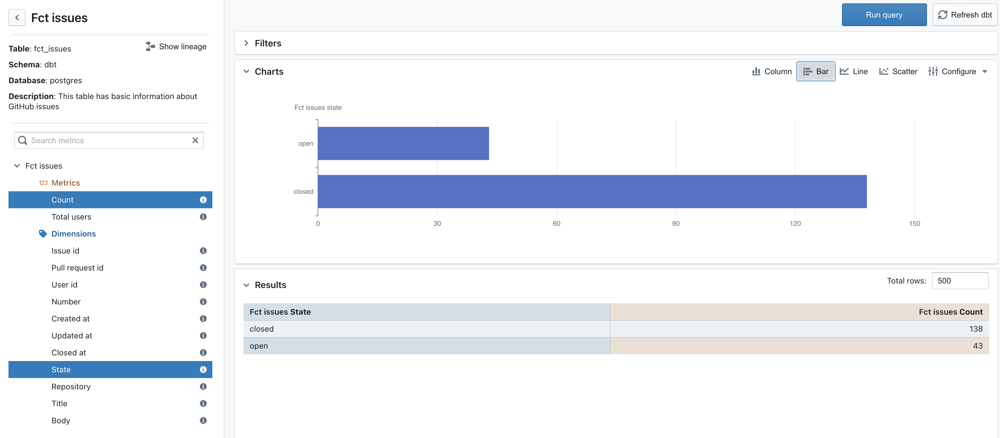

# Modern data pipeline for exploring GitHub data

Explore analytics data for a GitHub repo using a best-practice modern data pipeline:

1. Meltano/singer to **E**xtract raw data from the GitHub API
2. Meltano/postgres to **L**oad raw GitHub data into a postgres database
3. dbt to **T**ransform raw GitHub data into explorable tables
4. Lightdash to visualise and explore the transformed tables



## Requirements

* docker

## Usage

### 1. Clone the repo.
```
git clone git@github.com:lightdash/full-stack-tap-github.git
```

### 2. Configure  your credentials
Head into the `full-stack-tap-github` directory and create a file called `.env`
```
cd full-stack-tap-github
touch .env
```

Add the following credentials to your `.env` file. (**Note**: if you're new to GitHub personal access tokens, check out [how to create/find them here](https://docs.github.com/en/github/authenticating-to-github/keeping-your-account-and-data-secure/creating-a-personal-access-token).)
```
TAP_GITHUB_ACCESS_TOKEN=<your personal access token for GitHub>
TAP_GITHUB_REPOSITORY=<your GitHub repo e.g. lightdash/lightdash>
TAP_GITHUB_START_DATE=<start date e.g. 2020-10-01T00:00:00Z>
```

### 2. Install required meltano packages
From within the `full-stack-tap-github` directory, run:

```
docker compose run meltano install extractor tap-github
docker compose run meltano install loader target-postgres
docker compose run meltano install transformer dbt
```

### 3. Extract GitHub data, load it to postgres, transform it

```
docker compose run meltano
```

### 4. Visualise and explore data

```
docker compose up lightdash
```

Open [http://localhost:8080](http://localhost:8080)
